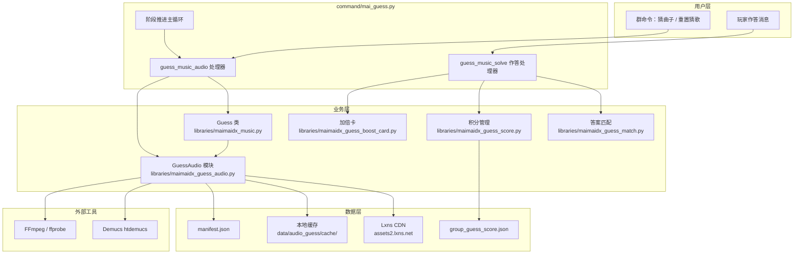
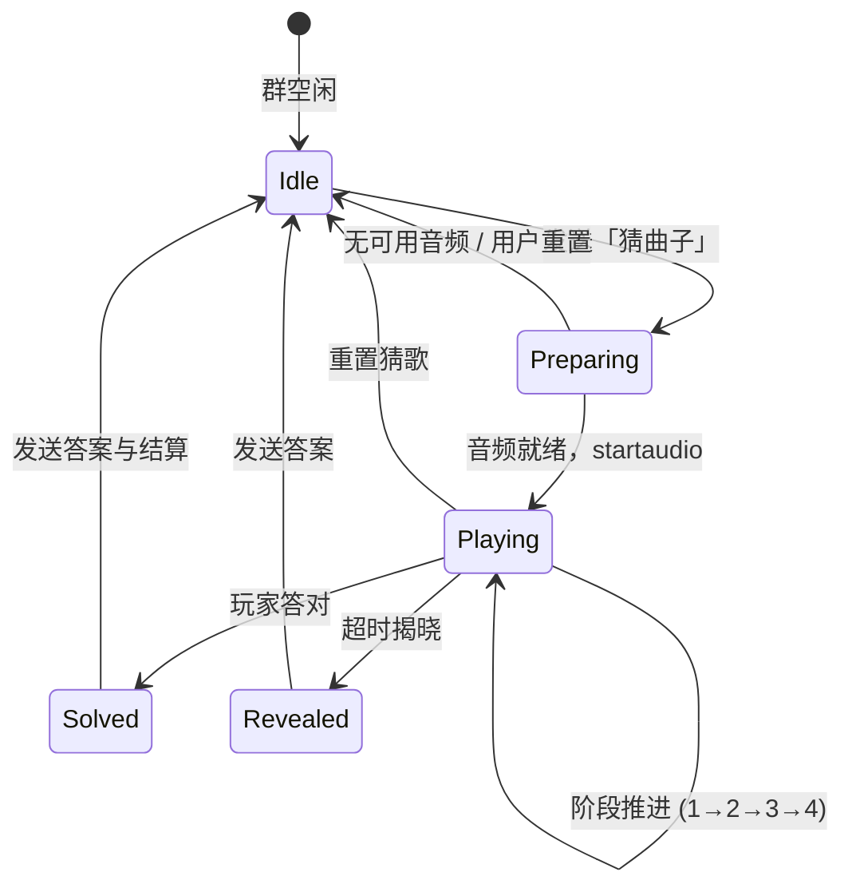

# maimai DX 猜曲子功能：设计与实现

**摘要：** 本文介绍 nonebot-plugin-maimaidx（AWMC 重制版）中「猜曲子」子系统的设计与实现。该功能在 QQ 群聊场景下，通过分阶段递进式音频提示引导玩家识别 maimai DX 热门曲目，并结合积分、排行榜与限时加倍卡等机制形成可持续运营的社群小游戏。系统核心创新在于：基于 Lxns CDN 拉取试听音频，利用 Demucs 源分离技术将乐曲拆分为鼓、贝斯、伴奏与人声四轨，按阶段混音生成难度递增的提示片段，并通过本地缓存与懒加载策略平衡实时性与服务器负载。

**关键词：** maimai DX；猜歌游戏；源分离；Demucs；NoneBot；群聊机器人

---

## 1. 引言

### 1.1 背景

maimai DX 是一款节奏游戏，拥有数百首曲目与活跃的玩家社群。在 QQ 群等即时通讯场景中，玩家常通过「猜歌」「猜曲绘」等形式进行互动娱乐。传统文字猜歌依赖曲目标题、难度、BPM 等元数据提示，曲绘猜歌依赖图像裁切与干扰处理；而「猜曲子」则进一步引入**真实音频片段**作为提示媒介，更贴近玩家对乐曲的听觉记忆，游戏沉浸感与挑战性显著增强。

### 1.2 目标与约束

猜曲子功能需满足以下设计目标：

| 目标 | 说明 |
|------|------|
| **渐进式提示** | 从仅鼓点逐步过渡到完整混音，降低初期难度 |
| **曲目可辨识性** | 答案池限定为游玩次数超过 1 万次的热门曲，排除宴会场曲目 |
| **低延迟开局** | 优先使用预烘焙缓存；无缓存时支持懒加载构建 |
| **群级隔离** | 每群同时仅允许一局猜歌/猜曲绘/猜曲子 |
| **积分激励** | 与文字猜歌、曲绘猜歌共享积分体系，支持多周期排行榜 |
| **跨平台适配** | 兼容 OneBot 与官方 QQ Bot 的消息形态 |

### 1.3 功能定位

猜曲子是猜歌体系的第三种模式，与「猜歌」（文字提示）和「猜曲绘」（图像提示）并列，共用答案匹配、积分结算与群开关管理模块，但在音频准备、阶段推进与计分规则上具有独立逻辑。

---

## 2. 系统架构

### 2.1 总体架构



### 2.2 模块职责划分

| 模块 | 路径 | 职责 |
|------|------|------|
| 命令入口 | `command/mai_guess.py` | 注册 NoneBot 命令、驱动游戏主循环、处理作答与重置 |
| 猜歌核心 | `libraries/maimaidx_music.py` | 曲目池选取、`GuessAudioData` 构造、群状态管理 |
| 音频管线 | `libraries/maimaidx_guess_audio.py` | CDN 下载、分轨、阶段混音、缓存校验 |
| 数据模型 | `libraries/maimaidx_model.py` | `GuessAudioData` 等 Pydantic 模型 |
| 答案匹配 | `libraries/maimaidx_guess_match.py` | 标题/别名/ID 规范化与模糊匹配 |
| 积分系统 | `libraries/maimaidx_guess_score.py` | 计分、连击、多周期榜、历史归档 |
| 加倍卡 | `libraries/maimaidx_guess_boost_card.py` | 群管发放、消耗、过期清理 |
| 定时任务 | `libraries/maimaidx_guess_scheduler.py` | 每日 23:55 周期榜结算推送 |
| 预烘焙脚本 | `scripts/build_guess_audio_cache.py` | 离线批量构建热门池缓存 |

---

## 3. 曲目池与答案构造

### 3.1 热门曲筛选

启动时，`MaiMusic.guess()` 遍历全曲库，统计每首曲目在各机台的上架游玩次数（`stats.cnt`），累计超过 **10,000 次**的曲目 ID 纳入 `hot_music_ids`，构成 `guess_data` 热门池。

```python
# libraries/maimaidx_music.py
if count > 10000:
    self.hot_music_ids.append(music.id)
self.guess_data = list(filter(lambda x: x.id in self.hot_music_ids, self.total_list))
```

### 3.2 宴会场过滤

宴会场（おとげ）曲目 ID ≥ 100000 或 genre 为「宴会場/宴会场」的曲目被排除在猜歌池外，避免冷门或特殊谱面影响游戏体验。

### 3.3 猜曲子专用池

猜曲子在热门池基础上进一步要求**音频缓存就绪**（`is_audio_ready`）。若就绪池为空，则对最多 12 首候选曲执行懒加载构建（`ensure_audio_ready`），构建成功方可开局。

### 3.4 答案集合

每局答案由曲目标题、官方别名及曲目 ID 组成：

```python
answer = mai.total_alias_list.by_id(music.id)[0].Alias
answer.append(music.id)
```

DX 谱面与标准谱面视为不同曲目（`music.type` 区分），玩家需精确匹配对应版本。

---

## 4. 音频处理管线

猜曲子的核心技术创新在于**分阶段源分离混音**。系统从 Lxns CDN 获取 MP3 试听，经 Demucs 或 FFmpeg 分轨后，按预设策略生成 4 个难度递增的 30 秒音频片段。

### 4.1 关键参数

| 参数 | 值 | 含义 |
|------|-----|------|
| `STAGE_COUNT` | 4 | 阶段总数 |
| `STAGE_DURATION` | 30s | 每段音频时长 |
| `STAGE_INTERVAL` | 20s | 阶段间隔（下一段放出前的等待） |
| `STAGE_FINAL_GRACE` | 60s | 第四段结束后的额外作答时间 |
| `SEPARATION_CLIP_DURATION` | 45s | 分轨前裁剪时长（降低 OOM 风险） |
| `STAGE_MIX_REV` | 2 | 混音逻辑版本号，变更时使旧缓存失效 |

### 4.2 四阶段标签与混音策略

```python
STAGE_LABELS = ('仅鼓点', '鼓点 + 贝斯', '加入伴奏', '完整混音')

DEMUCS_STAGE_STEMS = (
    ('drums',),
    ('drums', 'bass'),
    ('drums', 'bass', 'other'),
    ('drums', 'bass', 'other', 'vocals'),
)
```

各阶段含义：

1. **阶段 1 — 仅鼓点：** 只保留 drums 轨，玩家仅凭节奏型辨识
2. **阶段 2 — 鼓点 + 贝斯：** 加入 bass，低频律动更明显
3. **阶段 3 — 加入伴奏：** 混入 other（伴奏/器乐），旋律轮廓浮现
4. **阶段 4 — 完整混音：** 四轨全混，含人声，接近原曲

### 4.3 CDN 拉取与 ID 回落

音频源默认配置为 `https://assets2.lxns.net/maimai/music/{id}.mp3`，可通过 `maimaidx_audio_cdn_base` 覆盖。对于 DX 曲目等新 ID，系统会尝试多种回落 ID（如 `n-10000`、`n-11000`、去掉首位 `1` 等），提高 CDN 命中率。

### 4.4 分轨引擎选择

```
下载源 MP3
    │
    ├─ Demucs 可用 ──► htdemucs 四轨分离 ──► 按阶段混音导出
    │
    └─ Demucs 不可用 / 失败 ──► FFmpeg 近似分轨（带通/高通滤波模拟）
```

- **Demucs 路径：** 使用 `htdemucs` 模型，`segment=7`（受 CLI 整数限制），设备由 `maimaidx_demucs_device` 配置（默认 CPU）
- **FFmpeg 回退：** 通过频段滤波近似模拟鼓/贝斯/伴奏，保证无 GPU 环境仍可运行
- **校验机制：** 构建完成后校验各阶段 MD5，若阶段 1 与阶段 4 相同则判定分轨无效并拒绝缓存

### 4.5 片段裁切位置

系统通过 `ffprobe` 获取源曲时长，在约 28% 处（且不早于 20s）选取 30s 片段，避免前奏过长导致辨识度不足：

```python
def _pick_clip_offset(duration: float) -> float:
    if duration <= STAGE_DURATION + 2:
        return max(0.0, (duration - STAGE_DURATION) / 2)
    start = max(20.0, duration * 0.28)
    return min(start, max(0.0, duration - STAGE_DURATION - 3))
```

### 4.6 缓存结构

```
data/audio_guess/
├── manifest.json          # 曲目就绪状态、mix_rev、分轨模式
└── cache/
    └── {music_id}/
        ├── stage_01.mp3   # 仅鼓点
        ├── stage_02.mp3   # 鼓点+贝斯
        ├── stage_03.mp3   # 加入伴奏
        └── stage_04.mp3   # 完整混音
```

`manifest.json` 记录每首曲的 `ready`、`stages`、`mix_rev`、`mode`（demucs/ffmpeg）等元数据。当 `mix_rev` 升级但磁盘上四段文件完整且校验通过时，系统可自动「收养」旧缓存并更新 manifest，避免不必要的重复烘焙。

---

## 5. 游戏流程

### 5.1 状态机



群级并发控制通过 `Guess.Group`（进行中）与 `Guess.Preparing`（音频准备中）两个集合实现，同一群不可并行多局。

### 5.2 开局流程

1. 检查群开关（`guess.switch.enable`）
2. `try_begin_prepare(gid)` 获取准备锁
3. 发送「正在准备猜曲音频，请稍候…」
4. `prepare_audio_round()` 选曲并确保缓存
5. `startaudio(gid, data)` 注册群状态
6. `end_prepare(gid)` 释放准备锁
7. 进入阶段主循环

### 5.3 阶段主循环

```text
for stage_idx in 0..3:
    发送 stage_{idx+1}.mp3（语音消息，约 30s）
    hint_step = stage_idx + 1
    if 最后阶段:
        提示「最后 60 秒作答时间」
    else:
        等待 STAGE_INTERVAL (20s)，期间监听作答

等待 STAGE_FINAL_GRACE (60s)
超时 → 揭晓答案，重置全员连击
```

主循环使用可中断的 `_guess_sleep`：每秒检查 `end` 标志与群开关，支持「重置猜歌」即时退出。

### 5.4 作答处理

`guess_music_solve` 监听所有群消息（`rule=is_now_playing_guess_music`），对非空文本执行：

1. 记录 `user_attempts`，判断是否首答（`first_guess`）
2. `match_guess_answer(ans, data.answer)` 匹配
3. 答对 → 计算积分 → 发送曲绘信息 + 最终阶段音频 + 结算文案
4. `guess.end(gid)` 清除群状态

猜曲子的「首阶段」判定：`hint_step < 2`，即第二段音频发出前答对仍享首阶段 ×2 加成。

### 5.5 防作弊

猜歌进行中，部分查歌命令（如 BPM 查询、艺术家查询）会返回「本群正在猜歌，不要作弊哦~」，降低元数据泄露风险。但通用查歌命令仍可用，与开局提示一致。

---

## 6. 答案匹配算法

`match_guess_answer` 采用分级规范化策略：

| 步骤 | 规则 |
|------|------|
| 原始匹配 | 去首尾空白后与答案列表逐项比大小写不敏感 |
| 规范化 | `strictness=2`：小写、去尾部标点、去除空格与特殊符号 |
| ID 匹配 | 纯数字答案与规范化输入精确匹配 |
| 曲绘特例 | 难度 ≥3 时允许子串互含（长度 ≥2） |

文字猜歌与猜曲子使用 `strictness=2`；曲绘猜歌按难度动态调整。

---

## 7. 积分与激励体系

### 7.1 猜曲子基础分

按当前 `hint_step`（已放出阶段数）计分：

| hint_step | 基础分 |
|-----------|--------|
| 0（未放段） | 10 |
| 1 | 10 |
| 2 | 9 |
| 3 | 7 |
| 4 | 5 |

```python
AUDIO_STAGE_POINTS = (10, 9, 7, 5)
```

### 7.2 倍率叠加

最终得分 = `(基础分 + 连击加成) × 倍率乘积`

| 倍率项 | 条件 | 系数 |
|--------|------|------|
| 首阶段 | 猜曲子：第二段前答对 | ×2 |
| 首答 | 本局第一次作答即正确 | ×2 |
| 赛季限时双倍 | 猜曲子专属，截至 2026-06-30 | ×2 |
| 限时加倍卡 | 群管发放，猜对消耗 1 张 | ×2 |

理论最高倍率（猜曲子，赛季内）：`2 × 2 × 2 × 2 = 16`（不含连击）。开局提示文案中写「理论最高 8 倍」对应首阶段 × 首答 × 赛季双倍三项。

### 7.3 连击加成

答对者 `streak += 1`，其他群成员 `streak` 清零。连击加成 = `max(0, streak - 1)`，即 2 连击 +1、3 连击 +2，以此类推。局终超时或重置时调用 `reset_all_streaks` 清零全员连击。

### 7.4 排行榜周期

积分同时写入总榜与五个周期榜：

- 日榜 / 周榜 / 月榜 / 年榜 / 赛季榜（季度）

每日 23:55 定时任务 `archive_guess_score_periods` 对即将结束的周期执行归档，向已开启猜歌的群推送结算榜单，并写入 `group_guess_score_history.json`（每周期最多保留 30 条历史）。

---

## 8. 运维与管理

### 8.1 群管理命令

| 命令 | 权限 | 功能 |
|------|------|------|
| `开启mai猜歌` / `关闭mai猜歌` | 群管 | 群级功能开关 |
| `发加倍卡 @用户 [数量] [小时]` | 群管 | 发放限时加倍卡 |
| `查加倍卡` | 全员 | 查询剩余加倍卡 |
| `重置猜歌` | 全员 | 强制结束当前局 |

### 8.2 插件管理员命令

| 命令 | 功能 |
|------|------|
| `更新猜曲音频` | 增量烘焙热门池缓存 |
| `更新猜曲音频 -full` | 强制重建全部缓存 |

### 8.3 离线预烘焙

```bash
# 指定曲目 ID
python scripts/build_guess_audio_cache.py 417 837 11417

# 热门池全量（需已加载曲库）
python scripts/build_guess_audio_cache.py --hot
```

建议在部署环境安装 `demucs`、`lameenc`（或 `torchcodec`）及 `ffmpeg`，以获得最佳分轨质量。

### 8.4 配置项

```python
# config.py / .env
maimaidx_audio_cdn_base = 'https://assets2.lxns.net/maimai/music'
maimaidx_demucs_device = 'cpu'  # 或 cuda
```

### 8.5 容错与超时

- 文本消息发送超时 15s，媒体（图片/语音）60s
- 发送失败时强制结束本局，避免群状态悬挂
- Bot 关闭时注册 shutdown 钩子，终止进行中的 Demucs/FFmpeg 子进程

---

## 9. 与其他猜歌模式对比

| 维度 | 猜歌（文字） | 猜曲绘 | 猜曲子 |
|------|-------------|--------|--------|
| 提示媒介 | 元数据描述 + 封面裁切 | 曲绘裁切 + 图像干扰 | 分轨音频片段 |
| 提示步数 | 7 步（每 8s） | 扩增 + 全局 + 去干扰 | 4 阶段（每 20s 间隔） |
| 基础分范围 | 1–7 | 1–3（按难度） | 5–10（按阶段） |
| 准备时间 | 无 | 无 | 可能需要 CDN 下载与分轨 |
| 技术依赖 | PIL、NumPy | PIL、FFT 裁切 | Demucs、FFmpeg、httpx |
| 赛季双倍 | 无 | 无 | 有（限时活动） |

三种模式共享 `GuessData` 基类、`match_guess_answer`、积分存储与群开关，体现了**统一框架 + 模式扩展**的设计思路。

---

## 10. 性能与可扩展性分析

### 10.1 计算瓶颈

Demucs 分轨是 CPU/GPU 密集型操作。系统通过以下策略缓解：

- 分轨前仅裁剪 45s 源片段，降低内存占用
- 每曲目独立 asyncio 锁，避免重复构建
- 热门池预烘焙，开局优先命中 `is_audio_ready`
- 懒加载最多尝试 12 首，限制最坏情况延迟

### 10.2 存储估算

每首曲 4 × 30s MP3（128kbps）约 1.9 MB。热门池若有 500 首，缓存约 **1 GB**，需纳入部署规划。

### 10.3 可扩展方向

1. **mix_rev 升级：** 调整 `DEMUCS_STAGE_STEMS` 或时长后递增版本号，自动失效旧缓存
2. **自定义阶段数：** `STAGE_COUNT` 与 `GuessAudioData.stage_count` 已解耦
3. **GPU 加速：** 配置 `maimaidx_demucs_device=cuda` 缩短烘焙时间
4. **替代 CDN：** 修改 `maimaidx_audio_cdn_base` 接入其他音源

---

## 11. 结论

maimai DX 猜曲子功能将**音乐信息检索游戏**与**深度学习源分离**相结合，在群聊机器人场景下实现了可运营、可扩展的听觉猜歌体验。其设计要点包括：

1. **渐进式四阶段混音**，从鼓点逐步揭示完整乐曲，符合人类听觉认知规律
2. **Demucs + FFmpeg 双路径**，兼顾音质与部署普适性
3. **manifest 版本化缓存**，支持逻辑升级与旧缓存复用
4. **与积分体系深度整合**，通过首阶段、首答、连击、加倍卡、赛季活动等多维激励提升留存
5. **群级状态机与可中断循环**，保证并发安全与运维友好

该系统为节奏游戏社群机器人提供了从文字、图像到音频的完整猜歌能力矩阵，可作为同类 IM 游戏化功能的参考实现。

---

## 参考文献与依赖

- [Demucs: Music Source Separation](https://github.com/facebookresearch/demucs)
- [Lxns 落雪音乐库 CDN](https://assets2.lxns.net/)
- [NoneBot2 框架](https://nonebot.dev/)
- [nonebot-plugin-maimaidx 上游项目](https://github.com/Yuri-YuzuChaN/nonebot-plugin-maimaidx)
- AWMC TEAM 重制仓库：`https://github.com/AWMC-TEAM`

---

## 附录 A：用户命令速查

| 命令 | 说明 |
|------|------|
| `猜曲子` | 开始音频猜歌 |
| `猜歌` | 文字猜歌 |
| `猜曲绘` | 曲绘猜歌 |
| `重置猜歌` | 结束当前局 |
| `猜歌积分排行` | 总积分排行 |
| `猜歌积分日榜` / `周榜` / `月榜` / `年榜` / `赛季榜` | 各周期积分榜 |
| `猜歌历史日榜` / … | 历史周期榜 |

## 附录 B：核心源码索引

| 文件 | 说明 |
|------|------|
| `command/mai_guess.py` | 命令注册与游戏主循环 |
| `libraries/maimaidx_guess_audio.py` | 音频下载、分轨、缓存 |
| `libraries/maimaidx_music.py` | `Guess` 类与曲目池 |
| `libraries/maimaidx_guess_score.py` | 积分与排行榜 |
| `libraries/maimaidx_guess_match.py` | 答案匹配 |
| `libraries/maimaidx_model.py` | `GuessAudioData` 数据模型 |
| `scripts/build_guess_audio_cache.py` | 离线预烘焙工具 |

---

*文档版本：2026-07-07 · 基于 AWMC TEAM maimaiDX-QueryBot 代码库整理*
